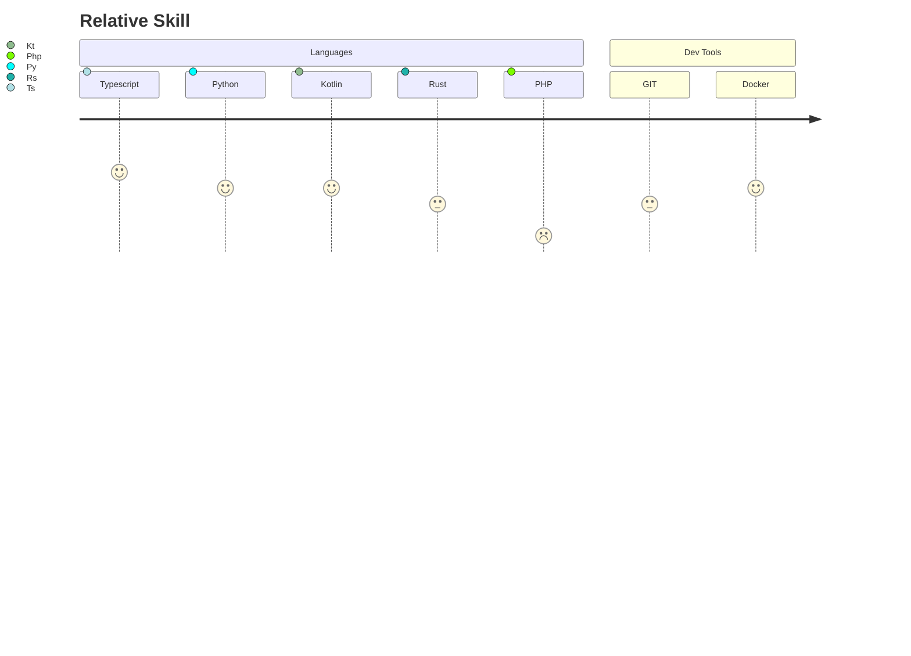
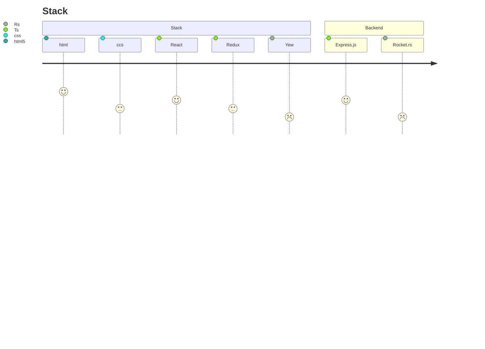

# 👋 Hi, I’m [Carlos](https://github.com/ccnmagnoo)

I'm Mechanical Engineering by profession, but also software developer by passion , 
working across diverse areas in project management for `sustainable projects` and `efficiency energy`. 
with 15th years’ experience, applying on diverse areas as a public servant and as a professional at private sector in energy services.

>### My motivations?
>As a professional with a vast creative impulse , 
I always found in software development a way to innovate in each job and task I was in charge, 
always searching a way to grow and continue learning 
in the infinite ocean of development as a tool for self-growing and satisfaction.

>I 💓 love learn new technologies, and also i dedicated a 
lot of time of my carrer as data analyst and project management.

## How to contact me?
<a href='mailto:ccampos@dvt.cl?subject=Hi%20Carlos!,%20I%20want%20to%20contact%20you'>just write me, I'll be happy to help U 👌!</a>

### My skills (relative ones)

let currentSkills = {
-  `Typescript` &ensp;🔘🔘🔘🔘🔘,
-   `Kotlin` &ensp;🔘🔘🔘🔘,
-  `Python` &ensp;🔘🔘🔘,
-  `html`&ensp;🔘🔘🔘,
-  `css`&nbsp;🔘🔘,
-  `Material UI` &ensp;🔘🔘🔘,
-  `Bootstrap` &ensp;🔘🔘,
-   `ReactJS/Hooks`&ensp;🔘🔘🔘🔘,
-  `GIT`&ensp;🔘🔘,
-  `dataAnalystBI`&ensp;🔘🔘🔘,
-  `APIrest/Express`&ensp;🔘🔘,
-  `Firebase/Cloud`&ensp;🔘🔘🔘🔘,
}

## Technologies I'm interest 
> `GraphQL`, 
`NextJS`,
`Tailwindcss`,
`Electron`,
  `React Native`,

<h4>Best wishes</h4>

<!---
ccnmagnoo/ccnmagnoo is a ✨ special ✨ repository because its `README.md` (this file) appears on your GitHub profile.
You can click the Preview link to take a look at your changes.
--->
